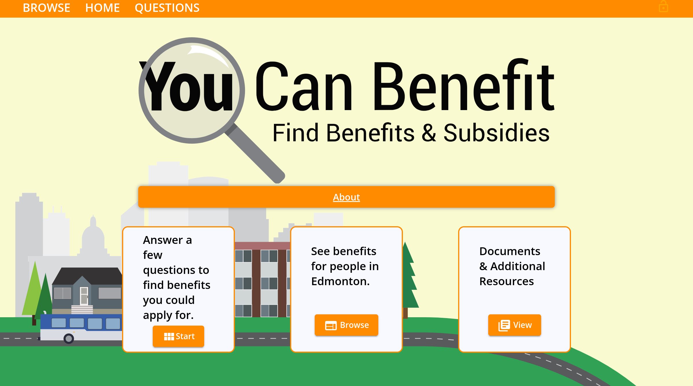

[try it live](https://youcanbenefit.edmonton.ca)

`YouCanBenefit` is a web application that increases social benefit program discoverability for people of lesser means and their allies. There are similiar projects, but where I think `YouCanBenefit` differs in at least some cases, is that it takes what the user likely knows -- their demographic information -- and compares against what the user likely has trouble finding -- the available social programs. It does not save user data.

## Contributing
We love contributors! Here are some tips for getting started.

### Slack
Join us in our Slack workspace! Get an invite [here](https://communityinviter.com/apps/youcanbenefit/you-can-benefit).

### Setting up the development environment
###### This was tested on Mac OS. It should work on most Linux distros that support Node.js. Windows users should try using Linux Subsystem for now.

| Angular  | NestJS | Elasticsearch |
| ------------- | ------------- | ------------ |
|   |   |  |

To get started, fork this repo to your GitHub account. Clone the fork to your dev machine. Ensure you have [Node.js v11](https://nodejs.org/en/download/) and [Docker](https://docs.docker.com/install/) installed.

There are 3 components required to run YCB.

#### Frontend
This is built using Angular (the new one). Navigate to the folder `frontend` inside the project root in your favorite cli. 

Run `npm ci` to install the dependencies.

Run `npm start` to start the frontend of the app up. You should see the app at `localhost:4200`.

#### Backend
This is built using a Node.js framework called [Nest](https://github.com/nestjs/nest). Navigate to the folder `backend` inside the project root in your favorite cli.

Run `npm ci` to install the dependencies.

Run `npm start` to start the backend of the app up. You should see the routes at `localhost:3000`. To confirm it's working, sending a GET to `localhost:3000` should yield Hello World!.

#### Elasticsearch
This provides the application its search and indexing abilities. You can set this up however you like, but I find using Docker is the easiest way. From [their documentation](https://www.elastic.co/guide/en/elasticsearch/reference/current/docker.html):

```
docker run -p 9200:9200 -p 9300:9300 -e "discovery.type=single-node" docker.elastic.co/elasticsearch/elasticsearch:6.4.2
```

Keep in mind, this will lose all the info when it's restarted.

#### Next Steps
You should now be able to hit the API, have the API talk to Elasticsearch and to be able to view the app. Lets load some data into it. Navigate to `localhost:4200/data` and click the initialize button and wait a moment. Next, navigate to `localhost:4200/data/upload` and upload this JSON file. This is an example of the City of Edmonton's YouCanBenefit setup. It should give an indication it was successful after a couple of seconds. Navigate to `http://localhost:4200/browse-programs/all` to confirm it was successful.

### Debugging
We use VS Code primarily, so it's easiest to get set up using that. For the front end, simply running the "Launch You Can Benefit frontend" debug task should pop up a debuggable instance of the Angular frontend. For the backend, ensure you have auto-attach turned on in VS Code. Run `npm start` from inside the `/backend` folder in VS Code's integrated terminal. This should automatically detect the running app and attach to it.

## Security Concerns
In the event that you find a vulnerability in YouCanBenefit, please email jared.rewerts@edmonton.ca.
